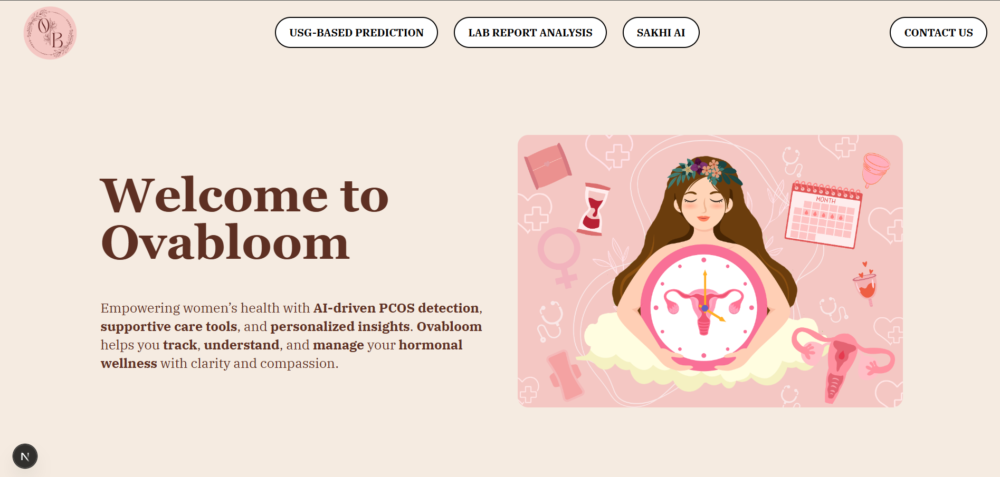

# OvaBloom 🌸
### AI-powered Personal Health Companion for Women with PCOS

OvaBloom is an AI-driven platform designed to support women navigating Polycystic Ovary Syndrome (PCOS). More than just a period tracker, OvaBloom combines medical insights, emotional wellness tools, and privacy-first AI features to offer personalized, compassionate care — all in one place.

# 🖼️ Gallery

## Detection using USG 

## Detection using Clinical and Physical Report Data

## Life-Management Recommendations

# ✨ Features
🧠 PCOS Risk Prediction: Upload clinical data or ultrasound images for real-time PCOS prediction using ML models (XGBoost, CNN).
📋 Personalized Dashboard: Period tracking, mood tracking, self-care suggestions, and lifestyle insights.
🔒 Privacy-Focused: All data is processed locally; nothing is stored on the cloud.
🌐 Simple, Clean UI: Built with React + TailwindCSS for a soothing, user-friendly experience.

# 🧠 AI & Tech Stack

Frontend: React.js + Tailwind CSS
Backend: Python (Flask / FastAPI)
ML Models:
XGBoost (for clinical data-based PCOS risk)
CNN (for ultrasound image classification)
Summary Generator: ReportLab / WeasyPrint / pdfkit (based on your implementation)
Local Storage: All user data is stored and processed locally

# 👩‍⚕ Who is this for?
Women looking for reliable PCOS tracking and insights
People facing irregular periods, hormonal imbalance, or PCOS symptoms
Healthcare providers who want patient-friendly tech support
 
# How It Works
1. User logs their symptoms or asks a question.
2. Ovabloom sends the data to OpenAI's GPT model.
3. The AI returns a personalized health or wellness response.
4. All logs and insights are stored for the user to view anytime.
